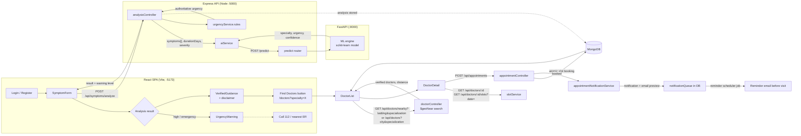

# Integration Flow — From Symptoms to Booking

This document describes the end-to-end patient journey and how the three
services (React frontend, Express backend, FastAPI AI service) connect.

## End-to-end flow

## Steps in detail

1. **Authentication** — `POST /api/auth/register|login` returns a JWT stored by
   the frontend; the axios interceptor attaches `Authorization: Bearer`.
2. **Symptom analysis** — `SymptomForm` sends `symptoms[]`, `durationDays`,
   `severity` to `POST /api/symptoms/analyze`. The backend calls
   `POST /predict` on the FastAPI service and falls back to a keyword-based
   mock when the AI service is unreachable (`services/aiService.js`).
3. **Safety override** — the rule-based urgency engine
   (`services/urgencyService.js` + `urgencyRules.json`) is authoritative:
   high/emergency results set `showTemporaryGuidance: false` and render the
   `UrgencyWarning` component. See `docs/urgency-rules.md`.
4. **Guided search** — the result card links to
   `/doctors?specialty=<recommendedSpecialty>`; `DoctorList` reads the query
   param, prefills the specialty field and auto-runs the search.
5. **Nearby verified doctors** — `GET /api/doctors/nearby` uses MongoDB
   `$geoNear`; manual fallback `GET /api/doctors?city=&specialization=`. Only
   `isVerified: true` doctors are returned.
6. **Booking** — `DoctorDetail` → `BookAppointment` fetches
   `GET /api/doctors/:id/slots?date=` and creates the appointment with
   `POST /api/appointments` (single-slot, no double booking; see
   `docs/database-design.md`).
7. **Notification** — booking triggers the notification module; a
   notification row is stored and a console/smtp email is dispatched. The
   reminder scheduler job (default 24 h lead, 5 min interval) pre-warns the
   patient. See `docs/notifications.md`.

## API surface used by the flow

| Step | Method + path | Auth |
| --- | --- | --- |
| Login | `POST /api/auth/login` | public |
| Analyze | `POST /api/symptoms/analyze` | public |
| AI predict (internal) | `POST /api/predict` on ai-service | none (service-to-service) |
| Nearby doctors | `GET /api/doctors/nearby?latitude&longitude&specialization&maxDistance` | public |
| Doctors by city | `GET /api/doctors?city&specialization` | public |
| Doctor profile | `GET /api/doctors/:id` | public |
| Doctor slots | `GET /api/doctors/:id/slots?date=YYYY-MM-DD` | public |
| Book appointment | `POST /api/appointments` | patient |
| My appointments | `GET /api/appointments/me` | patient |
| My notifications | `GET /api/notifications/me` | patient |

## Failure modes

- **AI service down** — backend degrades to keyword-based mock analysis; the
  API still returns a well-formed result flagged `source: mock`.
- **Geolocation denied** — `DoctorList` switches to city-based search.
- **MongoDB down** — backend fails fast at startup (`connectDB` throws and the
  process exits with an error message).
- **Duplicate booking** — unique partial index / slot-scan returns 409.